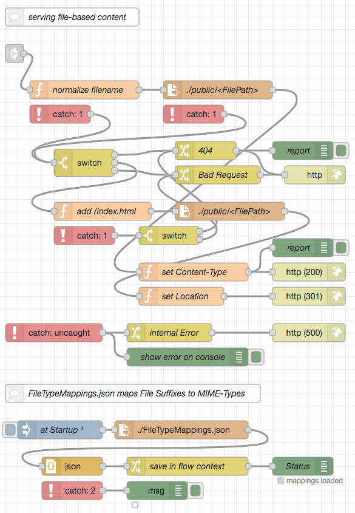
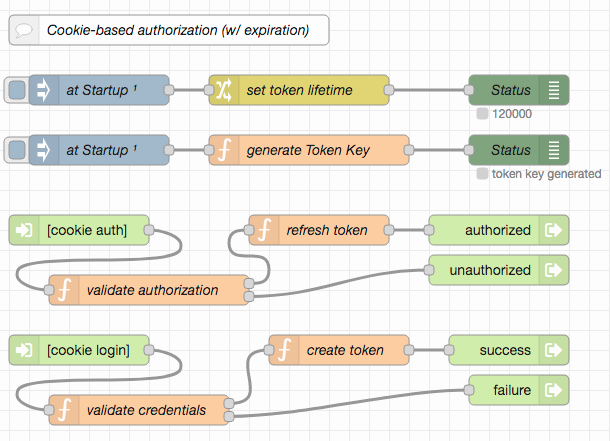
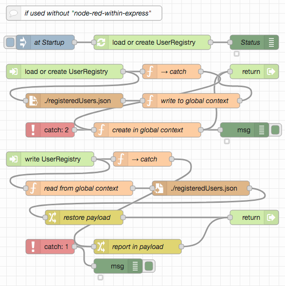

# node-red-web-server-examples #

This collection of [Node-RED](https://nodered.org/) examples (with a matching [Postman](https://www.postman.com/) collection for testing) is mainly intended for my students, but parts of it may also be of more general interest.

It is the continuation of another set of [HTTP(S)-related examples](https://github.com/rozek/node-red-http-endpoint-examples) and explains how to implement some basic file-based web servers with or without custom HTTP endpoints and with or without cookie-based authorization. The next step in this series is a collection of examples for [basic REST services](https://github.com/rozek/node-red-rest-service-examples), also built with Node-RED.

While it is generally not a good idea to use Node-RED for a web server that just serves static files (as there is a myriad of alternatives which are more performant, more secure and have more features), it may become necessary if you plan to use a Node-RED hoster and have no control over the underlying server. One of the following examples may then be used to accompany the HTTP endpoints for which you need Node-RED in the first place.

For this series, it is assumed that the reader already installed Node-RED (as described in [Getting Started](https://nodered.org/docs/getting-started/)), optionally secured the editor (as shown in [Securing Node-RED](https://nodered.org/docs/user-guide/runtime/securing-node-red)) and started using it (as explained in [Creating your first flow](https://nodered.org/docs/tutorials/first-flow))

### Required Extensions ###

For these examples to be run, it is necessary to install the following extension:

* [node-red-contrib-reusable-flows](https://github.com/ollixx/node-red-contrib-reusable-flows) "Reusable Flows" allow multiply needed flows to be defined once and then invoked from multiple places

## Examples ##

All example specifications are stored in JSON format and may easily be imported into a Node-RED workspace. Preferrably, you should open a separate tab and insert them there.

To test the examples, a [Postman collection](https://raw.githubusercontent.com/rozek/node-red-web-server-examples/main/PostmanCollection.json) is included, which may easily be imported into a running [Postman](https://www.postman.com/) instance. After the import, you should open the collection's "Variables" section and set the `BaseURL` to the base URL of your NodeRED instance (by default, it is set to `127.0.0.1:1880`, which should work out-of-the-box for most Node-RED installations). If your Node-RED instance has been configured to require basic authentication, you should also set the variables `Username` and `Password`)

Alternatively, other tools like [cURL](https://curl.se/) may be used as well.

### Simple (and open) Web Server ###

The first example in this series is a simple web server delivering files found in a configured directory.

> For this example to work, please copy file `FileTypeMappings.json` and folder `public` into the working directory of your Node-RED instance

The server is principally "open" for everybody as not extra authorization is needed to get responses for sent requests.

A simple path normalization asserts that clients may only request files from within the configured directory and may not inspect the whole file system.

If the requested path is that of a directory, the client is redirected to a file "index.html" in that directory. If no file exists at the requested path, a response with the status code 404 (Not Found) is sent back.

The server recognizes many different file types by looking at their type suffixes and sets the "Content-Type" header accordingly (see file [FileTypeMappings.json](https://raw.githubusercontent.com/rozek/node-red-web-server-examples/main/FileTypeMappings.json) for the complete set) 

Unforeseen errors are caught by a generic "catch" node and result in a response with status code 500 ("Internal Server Error")

Node-RED's debug console serves as a kind of "logger" and informs about any served files or any errors that occur.

Simply import the [example from this repo](examples/simple-web-server.json) into your Node-RED workspace and deploy. You may then test your server either by navigating your browser to `{{BaseURL}}/simple-web-server` or using the included Postman collection. Currently, the `public` folder contains two files only, but you are free to add as many files as you like.

> Please note: usually, it is not a good idea to use Node-RED just for static file serving - there are lots of other solutions which are even simpler to install and configure and are much more performant and secure than this example. If, however, a server with custom endpoints is needed which *also* serves some static files, this example may be quite practical.

### Custom (and still open) Web Server ###

As mentioned before, Node-RED becomes interesting as soon as servers with custom endpoints will be needed. The following example demonstrates such a scenario: in addition to the part mentioned before which serves static files only, three new endpoints are introduced that *compute* responses rather than load them from a file system:

* `{{BaseURL}}/custom-web-server/server-time` simply sends the current server time in ISO format,
* `{{BaseURL}}/custom-web-server/echo` responds with a JSON object containing important parts of the `msg.req` object for the received request,
* `{{BaseURL}}/custom-web-server/client-address` determines the IP address of the connected client and returns it

Because of the way in which these endpoints are recognized, more endpoints may easily be added (or unwanted ones removed). Static file serving is still included and starts if no custom endpoint was found - the flow needed is the same as in the previous example, which is why it has been connected using a "link" node: in this way, several implementations may use the same sequence of nodes without having to copy them.

> For this example to work, please copy file `FileTypeMappings.json` and folder `public` into the working directory of your Node-RED instance

The following part is already known from the previous example:

To test this server, just import the ["custom web server" example](examples/custom-web-server.json) into your Node-RED workspace and deploy. It works similar to the "simple Web Server" presented before - with the exception, that requests to `{{BaseURL}}/custom-web-server/server-time`, `{{BaseURL}}/custom-web-server/echo` or `{{BaseURL}}/custom-web-server/client-address` will now be processed internally even if files with these names exist in the `public` directory. The included Postman collection may help you testing.

### Closed Web Server ###

Often, web servers are not completely open for everybody - instead, some (or all) entry points are protected and require clients to authenticate themselves before being authorized to access these resources.

Protecting entry points usually implies some kind of authorization management. In the following example, Node-RED developers (like you) first have to explicitly create new users themselves (without specifying any initial password for them), and may later also reset user passwords or delete users - all this is done within the Node-RED server workspace. Without prior authorization, users created this way are only allowed to define their passwords or delete themselves as long as no password is set - this is done through HTTP endpoints (where it is assumed that these users are in contact with a Node-RED developer who informs them about the appropriate time). For all other operations users have to "login" first (presenting their user name and current password). They may then change their password, delete themselves - and navigate to the other endpoints this server offers.

This kind of "developer-driven user management" gives developers full control over the users they permit, but still keeps user passwords secret from them. On the other hand, users have full control over their passwords and may also delete their accounts - but no user is allowed to register him/herself. 

Authorization itself is handled using the "Cookie-based Authorization" taken from the author's [Node-RED Authorization Examples](https://github.com/rozek/node-red-authorization-examples) and may easily be replaced by a differend method (if "basic HTTP Authorization" is preferred, the "login" endpoint may be removed as it will be no longer necessary)

User data is kept in a JSON file called `registeredUsers.json` within the working directory of the running Node-RED instance. It should be read upon start-up and written whenever any user-related setting changes. The file contains a "dictionary" of user ids with password hashes and "role" lists as values. These hashes are computed using PBKDF2 with random salt - this avoids having to store passwords in plain text form and makes automated dictionary attacks more difficult.

User ids are mostly arbitrary - this server does not make any assumptions about their format (except that they must not contain neither colons (":") nor control characters and the upper and lower case is not distinguished). Their length should however be limited since cookies are not allowed to occupy more than 4093 characters (including their name and some other cookie details) - assuming a length limit of 2048 bytes seems like a good idea.

> For this example to work, please copy file `FileTypeMappings.json` and folder `public` into the working directory of your Node-RED instance

The main part of this server consists of HTTP entry points for file retrieval and user management, extended by some "offline" methods (for the flow developer) to create, list and delete users:

The actual file retrieval is already known from the previous examples:

As mentioned before, the actual authentication and authorization originates from [another package](https://github.com/rozek/node-red-authorization-examples) and is shown here for the sake of completeness only:

If this flow is not used within the [Express server with an embedded Node-RED instance](https://github.com/rozek/node-red-within-express) (which is very likely as that server already serves static files itself) it will also be necessary to provide functions to read and write the user registry:

To test this server, just import the ["closed web server" example](examples/closed-web-server.json) into your Node-RED workspace and deploy. Any "administrative" operations have to be performed using Node-RED itself (just enter the names of the affected users into the `inject` nodes labelled "(re)set user" and "delete user"), the included Postman collection expects that you create a user called "John.Doe@mail.de" and this user then sets his password in order to get access to the served web pages.

In this example, *all* endpoints (except those needed for authorization management) demand a successful authorization before being processed. In practice, there is often a mixture of public and private endpoints - a situation which may easily be implemented by combining flows from this example and the previous one.

## License ##

[MIT License](LICENSE.md)
